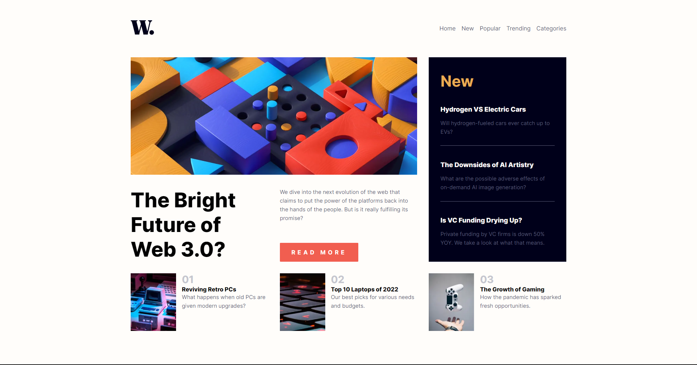

# Frontend Mentor - News homepage solution

This is a solution to the [News homepage challenge on Frontend Mentor](https://www.frontendmentor.io/challenges/news-homepage-H6SWTa1MFl). Frontend Mentor challenges help you improve your coding skills by building realistic projects.

## Table of contents

-   [Overview](#overview)
    -   [The challenge](#the-challenge)
    -   [Screenshot](#screenshot)
    -   [Links](#links)
    -   [Built with](#built-with)
-   [Author](#author)

## Overview

### The challenge

Users should be able to:

-   View the optimal layout for the interface depending on their device's screen size
-   See hover and focus states for all interactive elements on the page
-   **Bonus**: Toggle the mobile menu (requires some JavaScript)

### Screenshot

### Links

-   Solution URL: [GitHub repo](https://github.com/oOOoutsiderOOo/frontend-mentor-url-shortening)
-   Live Site URL: [Vercel](https://frontend-mentor-url-shortening-git-main-ooooutsiderooo.vercel.app/)

### Built with

-   Semantic HTML5 markup
-   CSS custom properties
-   Flexbox
-   CSS Grid
-   Typescript
-   [React](https://reactjs.org/) - JS library
-   [Next.js](https://nextjs.org/) - React framework
-   [Framer motion](https://www.framer.com/motion/) - Animation library

## Author

-   Frontend Mentor - [@oOOoutsiderOOo](https://www.frontendmentor.io/profile/oOOoutsiderOOo)
